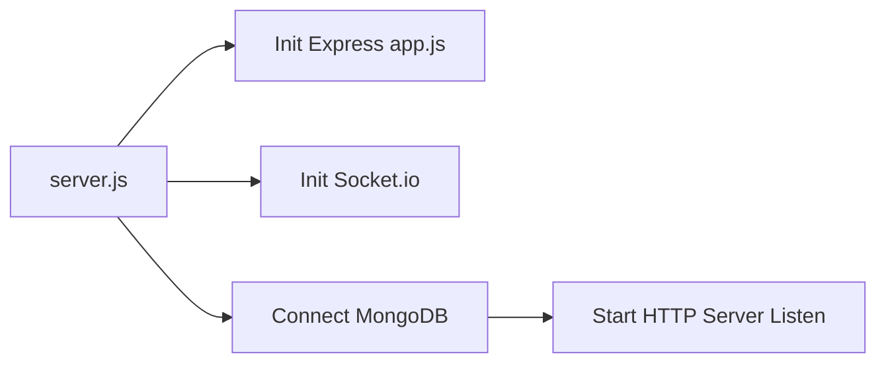

# 🏗️ Store Management Backend Architecture & Directory Guide

Welcome to the backend service for the **Store Management ERP System**. This project is built using **Node.js (ES Modules)**, **Express 5**, **MongoDB (Mongoose)**, **Socket.IO**, and **MSG91 Email API**.

---

## 📁 Directory & File Structure

```
store-managment-BE/
├── server.js                          # HTTP Server entry point & graceful shutdown
├── package.json                       # Project metadata, dependencies & scripts
├── dockerfile                         # Docker container image build instructions
├── docker-compose.yml                 # Multi-container orchestration config
├── .env.development                   # Development environment variables
├── .env.example                       # Template environment variables for setup
├── .gitignore                         # Files ignored by Git
├── .dockerignore                      # Files ignored by Docker
├── eslint.config.js                   # Code linting configuration
├── jest.config.js                     # Testing framework configuration
├── .prettierrc                        # Code formatting configuration
├── README.md                          # Quick start guide
├── ARCHITECTURE.md                    # Detailed architecture documentation
│
└── src/                               # Application source code
    ├── app.js                         # Express application setup & middleware stack
    ├── socket.js                      # Real-time WebSocket server setup & auth
    │
    ├── config/                        # Core configuration modules
    │   ├── db.js                      # MongoDB connection helper & event listeners
    │   ├── env.js                     # Environment variable validation & loader
    │   ├── mailer.js                  # MSG91 v5 Email API handler (with stub fallback)
    │   ├── s3.js                      # AWS / Object Storage S3 client configuration
    │   └── storage.js                 # Multer memory storage & file type filters
    │
    ├── constants/                     # Application-wide constants
    │   └── cookieOptions.constants.js # HTTP-only cookie configurations for JWTs
    │
    ├── controllers/                   # Request handler logic (separated by role)
    │   ├── admin/                     # Admin endpoint controllers
    │   └── store-employee/            # Store Employee endpoint controllers
    │
    ├── cron/                          # Scheduled cron jobs directory
    │
    ├── middlewares/                   # Custom Express middlewares
    │   ├── admin.auth.middleware.js   # JWT authentication middleware for Admins
    │   ├── storeEmployee.auth.middleware.js # JWT auth middleware for Store Employees
    │   ├── error.middleware.js        # Global error handler (handles Mongoose/Multer/JWT errors)
    │   ├── notificationContext.middleware.js # Sets req.userId & req.userType for context
    │   ├── parseForm.middleware.js    # Parses form-data inputs (JSON strings & nested keys)
    │   ├── rate-limit.middleware.js   # API & Auth rate limiting (express-rate-limit)
    │   └── validate.middleware.js     # Schema validation middleware (supports Zod)
    │
    ├── models/                        # Mongoose database models
    │   ├── admin.model.js             # Admin user schema (superadmin/admin roles)
    │   └── storeEmployee.model.js     # Store Employee schema (employeeId, designation)
    │
    ├── routes/                        # Express API route declarations
    │   ├── index.js                   # Base router (/api mounting /admin & /store-employee)
    │   ├── admin/
    │   │   └── index.js               # Admin sub-routes entry point
    │   └── store-employee/
    │       └── index.js               # Store Employee sub-routes entry point
    │
    ├── services/                      # Reusable business & domain logic layer
    ├── templates/                     # Email & document templates
    ├── utils/                         # Helper utilities & functions
    │   ├── api-error.js               # Custom ApiError class & HTTP status helpers
    │   ├── api-response.js            # Standardized success response formatter
    │   ├── crypto.js                  # AES-256-CBC encryption & decryption utility
    │   ├── logger.js                  # Winston logger configuration
    │   ├── pagination.js              # Database query pagination helper
    │   └── timezone.js                # Asia/Kolkata date/time conversion helpers
    └── validations/                   # Validation schemas (e.g. Zod schemas)
```

---

## ⚡ How the Backend Works (Request Flow)

### 1. Startup & Bootstrap Flow (`server.js`)
1. When you run `npm run dev` or `npm start`, Node executes `server.js`.
2. `server.js` creates a native HTTP server wrapping the Express app (`src/app.js`).
3. It initializes Socket.IO (`src/socket.js`) on top of the HTTP server.
4. It connects to MongoDB (`src/config/db.js`) using `env.MONGO_URI`.
5. Once DB connection succeeds, HTTP server begins listening on `env.PORT` (default `4000`).
6. Unhandled process signals (`SIGINT`, `SIGTERM`) trigger graceful shutdown: closing HTTP connections and disconnecting Mongoose safely.



---

### 2. Request Handling Lifecycle (`src/app.js` → `src/routes/`)

Every incoming HTTP request passes through a defined pipeline:

```mermaid
flowchart TD
    Req[Incoming Request] --> Security[Helmet & CORS Middleware]
    Security --> Parsers[Body & Cookie Parsers]
    Parsers --> LogCompress[Morgan Logger & Gzip Compression]
    LogCompress --> RateLimit[Rate Limiter Middleware]
    RateLimit --> HealthCheck{/health Route?}
    HealthCheck -- Yes --> HealthRes[Return Status 200 OK]
    HealthCheck -- No --> ApiRoutes[/api Routes Router]
    ApiRoutes --> AuthCheck{Auth Required?}
    AuthCheck -- Yes --> AuthMiddleware[Admin / Store Employee Auth Middleware]
    AuthCheck -- No --> Controller[Route Controller Function]
    AuthMiddleware --> Controller
    Controller --> Service[Business Logic Service]
    Service --> Model[Mongoose Model Database Operation]
    Model --> Res[Send JSON Response]
    Controller -- Error --> GlobalError[Global Error Handler Middleware]
```

1. **Security & Headers**: `helmet()` protects against common headers vulnerabilities, `cors()` manages cross-origin resource sharing.
2. **Parsers**: Parses incoming JSON payloads (`express.json`), form data (`express.urlencoded`), and cookies (`cookie-parser`).
3. **Logging & Compression**: `morgan` logs requests in dev/prod format; `compression` compresses responses using gzip.
4. **Rate Limiting**: `apiLimiter` limits requests per IP (100 requests per minute).
5. **Route Matching**:
   - `/health` → Returns quick status payload (`{ status: 'ok' }`).
   - `/api` → Directed to `src/routes/index.js`.
     - `/api/admin/*` → Directed to `src/routes/admin/index.js`.
     - `/api/store-employee/*` → Directed to `src/routes/store-employee/index.js`.
6. **Authentication Check**: Middleware (`admin.auth.middleware.js` or `storeEmployee.auth.middleware.js`) verifies JWT from cookies or Authorization header, validates database existence and active status.
7. **Global Error Handler**: Any thrown error or `next(err)` call lands in `src/middlewares/error.middleware.js`, which formats standard JSON error responses.

---

## 🔐 Multi-Role Auth Architecture

The system supports two distinct roles:

| Role | Auth Secret Env Variable | Auth Middleware | Cookie Name | Mongoose Model |
|---|---|---|---|---|
| **Admin** | `ADMIN_JWT_SECRET` | [`admin.auth.middleware.js`](file:///c:/Users/Dell/Desktop/store-managment-BE/src/middlewares/admin.auth.middleware.js) | `adminToken` | [`admin.model.js`](file:///c:/Users/Dell/Desktop/store-managment-BE/src/models/admin.model.js) |
| **Store Employee** | `STORE_EMPLOYEE_JWT_SECRET` | [`storeEmployee.auth.middleware.js`](file:///c:/Users/Dell/Desktop/store-managment-BE/src/middlewares/storeEmployee.auth.middleware.js) | `storeEmployeeToken` | [`storeEmployee.model.js`](file:///c:/Users/Dell/Desktop/store-managment-BE/src/models/storeEmployee.model.js) |

### How Authentication Works:
1. User logs in via Auth Controller.
2. Server issues a JWT signed with the role's respective secret key.
3. Token can be returned in JSON response or set in an HTTP-only secure cookie using settings from [`cookieOptions.constants.js`](file:///c:/Users/Dell/Desktop/store-managment-BE/src/constants/cookieOptions.constants.js).
4. Protected routes use the role's auth middleware, which decodes the token, fetches the user record, ensures `status === 'active'`, and attaches user info to `req.admin` or `req.storeEmployee`.

---

## 📡 Real-time WebSockets (`src/socket.js`)

- WebSockets use **Socket.IO**.
- Socket connection requires authentication credentials sent in handshake (`auth: { token, role }`), headers, or cookies.
- Socket middleware verifies token using role-specific JWT secret.
- Connected users are automatically joined to isolated private notification channels:
  - Admin: `notif:Admin:<userId>`
  - Store Employee: `notif:StoreEmployee:<userId>`

---

## 📧 Email Notification System (`src/config/mailer.js`)

- Emails are delivered via **MSG91 v5 Email API**.
- Function signature:
  ```js
  import { sendMail } from './config/mailer.js';

  await sendMail({
    to: 'user@example.com',
    toName: 'John Doe',
    subject: 'Welcome to Store ERP',
    templateId: 'your_msg91_template_id',
    variables: { company_name: 'Store Management' }
  });
  ```
- **Development Fallback Stub**: If `MSG91_AUTH_KEY` or `MSG91_DOMAIN` are set to default dev values, email sending will simulate delivery and log details cleanly to console without failing.

---

## 🛠️ Key Utilities & Helpers

- **[`api-error.js`](file:///c:/Users/Dell/Desktop/store-managment-BE/src/utils/api-error.js)**: Standardized error helpers (`badRequest()`, `unauthorized()`, `notFound()`, `forbidden()`, `conflict()`).
- **[`api-response.js`](file:///c:/Users/Dell/Desktop/store-managment-BE/src/utils/api-response.js)**: Standard response structure `{ success: true, message, data, pagination }`.
- **[`crypto.js`](file:///c:/Users/Dell/Desktop/store-managment-BE/src/utils/crypto.js)**: AES-256-CBC string encryption (`encrypt()`, `decrypt()`) using `CRYPTO_KEY`.
- **[`timezone.js`](file:///c:/Users/Dell/Desktop/store-managment-BE/src/utils/timezone.js)**: Date conversions for `Asia/Kolkata` time zone and start-of-day/end-of-day date range queries.
- **[`pagination.js`](file:///c:/Users/Dell/Desktop/store-managment-BE/src/utils/pagination.js)**: Calculate `skip`, `limit`, `totalPages`, `hasPreviousPage`, `hasNextPage` for MongoDB pagination.
